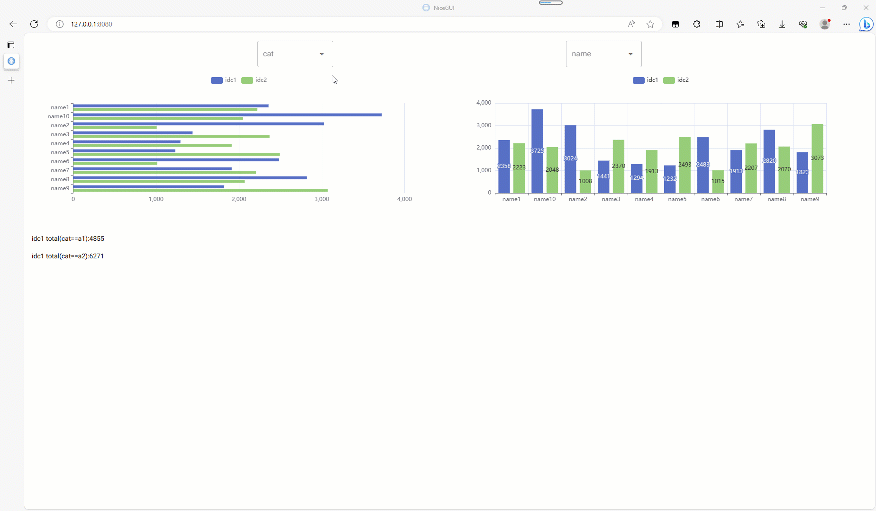

# ex4nicegui
[中文 README](./README.md)

- [Install](#-install)
- [Usage](#-usage)
- [Features](#-features)
- [BI Module](#bi-module)

An extension library for [nicegui](https://github.com/zauberzeug/nicegui). It has built-in responsive components and fully implements data-responsive interface programming.


## 📦 Install

```
pip install ex4nicegui -U
```

## 🦄 Usage

```python
from nicegui import ui
from ex4nicegui import ref_computed, effect, to_ref
from ex4nicegui.reactive import rxui

# Define responsive data
r_input = to_ref("")

# Pass in the responsive data according to the nicegui usage method.
rxui.input(value=r_input)
rxui.label(r_input)

ui.run()
```


## 🚀 Features

### echarts components

```python
from nicegui import ui
from ex4nicegui import ref_computed, effect, to_ref
from ex4nicegui.reactive import rxui

r_input = to_ref("")


# ref_computed Creates a read-only reactive variable
# Functions can use any other reactive variables automatically when they are associated
@ref_computed
def cp_echarts_opts():
    return {
        "title": {"text": r_input.value}, #In the dictionary, use any reactive variable. Get the value by .value
        "xAxis": {
            "type": "category",
            "data": ["Mon", "Tue", "Wed", "Thu", "Fri", "Sat", "Sun"],
        },
        "yAxis": {"type": "value"},
        "series": [
            {
                "data": [120, 200, 150, 80, 70, 110, 130],
                "type": "bar",
                "showBackground": True,
                "backgroundStyle": {"color": "rgba(180, 180, 180, 0.2)"},
            }
        ],
    }


input = rxui.input("Enter the content, and the chart title will be synchronized", value=r_input)

# Get the native nicegui component object through the element attribute of the responsive component object
input.element.classes("w-full")

rxui.echarts(cp_echarts_opts).classes('h-[20rem]')

ui.run()
```


### echarts mouse events

the `on` function parameters `event_name` and `query` to view the[echarts English Documentation](https://echarts.apache.org/handbook/en/concepts/event/)


The following example binds the mouse click event
```python
from nicegui import ui
from ex4nicegui.reactive import rxui

opts = {
    "xAxis": {"type": "value", "boundaryGap": [0, 0.01]},
    "yAxis": {
        "type": "category",
        "data": ["Brazil", "Indonesia", "USA", "India", "China", "World"],
    },
    "series": [
        {
            "name": "first",
            "type": "bar",
            "data": [18203, 23489, 29034, 104970, 131744, 630230],
        },
        {
            "name": "second",
            "type": "bar",
            "data": [19325, 23438, 31000, 121594, 134141, 681807],
        },
    ],
}

bar = rxui.echarts(opts)

def on_click(e: rxui.echarts.EChartsMouseEventArguments):
    ui.notify(f"on_click:{e.seriesName}:{e.name}:{e.value}")

bar.on("click", on_click)
```


The following example only triggers the mouseover event for a specified series.
```python
from nicegui import ui
from ex4nicegui.reactive import rxui

opts = {
    "xAxis": {"type": "value", "boundaryGap": [0, 0.01]},
    "yAxis": {
        "type": "category",
        "data": ["Brazil", "Indonesia", "USA", "India", "China", "World"],
    },
    "series": [
        {
            "name": "first",
            "type": "bar",
            "data": [18203, 23489, 29034, 104970, 131744, 630230],
        },
        {
            "name": "second",
            "type": "bar",
            "data": [19325, 23438, 31000, 121594, 134141, 681807],
        },
    ],
}

bar = rxui.echarts(opts)

def on_first_series_mouseover(e: rxui.echarts.EChartsMouseEventArguments):
    ui.notify(f"on_first_series_mouseover:{e.seriesName}:{e.name}:{e.value}")


bar.on("mouseover", on_first_series_mouseover, query={"seriesName": "first"})

ui.run()
```
---


## responsive

```python
from ex4nicegui import (
    to_ref,
    ref_computed,
    on,
    effect,
    effect_refreshable,
    batch,
    event_batch,
    deep_ref,
)
```
Commonly used `to_ref`,`deep_ref`,`effect`,`ref_computed`,`on`

### `to_ref`
Defines responsive objects, read and written by `.value`.
```python
a = to_ref(1)
b = to_ref("text")

a.value =2
b.value = 'new text'

print(a.value)
```

When the value is a complex object, responsiveness of nested objects is not maintained by default.

```python
a = to_ref([1,2])

@effect
def _().
    print(len(a.value))

# doesn't trigger the effect
a.value.append(10)

# the whole substitution will be triggered
a.value = [1,2,10]
```

Depth responsiveness is obtained when `is_deep` is set to `True`.

```python
a = to_ref([1,2],is_deep=True)

@effect
def _():
    print('len:',len(a.value))

# print 3
a.value.append(10)

```

> `deep_ref` is equivalent to `to_ref` if `is_deep` is set to `True`.
---

### `deep_ref`
Equivalent to `to_ref` when `is_deep` is set to `True`.

Especially useful when the data source is a list, dictionary or custom class. Objects obtained via `.value` are proxies

```python
data = [1,2,3]
data_ref = deep_ref(data)

assert data_ref.value is not data
```

You can get the raw object with `to_raw`.
```python
from ex4nicegui import to_raw, deep_ref

data = [1, 2, 3]
data_ref = deep_ref(data)

assert data_ref.value is not data
assert to_raw(data_ref.value) is data
```

---

### `effect`
Accepts a function and automatically monitors changes to the responsive objects used in the function to automatically execute the function.

```python
a = to_ref(1)
b = to_ref("text")


@effect
def auto_run_when_ref_value():
    print(f"a:{a.value}")


def change_value():
    a.value = 2
    b.value = "new text"


ui.button("change", on_click=change_value)
```

The first time the effect is executed, the function `auto_run_when_ref_value` will be executed once. After that, clicking on the button changes the value of `a` (via `a.value`) and the function `auto_run_when_ref_value` is executed again.

> Never spread a lot of data processing logic across multiple `on`s or `effects`s, which should be mostly interface manipulation logic rather than responsive data processing logic

---

### `ref_computed`
As with `effect`, `ref_computed` can also return results from functions. Typically used for secondary computation from `to_ref`.

```python
a = to_ref(1)
a_square = ref_computed(lambda: a.value * 2)


@effect
def effect1():
    print(f"a_square:{a_square.value}")


def change_value():
    a.value = 2


ui.button("change", on_click=change_value)
```

When the button is clicked, the value of `a.value` is modified, triggering a recalculation of `a_square`. As the value of `a_square` is read in `effect1`, it triggers `effect1` to execute the

> `ref_computed` is read-only `to_ref`

If you prefer to organize your code by class, ``ref_computed`` also supports acting on instance methods

```python
class MyState.
    def __init__(self) -> None.
        self.r_text = to_ref("")

    @ref_computed
    def post_text(self): return self.r_text.value
        return self.r_text.value + "post"

state = MyState()

rxui.input(value=state.r_text)
rxui.label(state.post_text)
```

---

### `on`
Similar to `effect`, but `on` needs to explicitly specify the responsive object to monitor.

```python

a1 = to_ref(1)
a2 = to_ref(10)
b = to_ref("text")


@on(a1)
def watch_a1_only():
    print(f"watch_a1_only ... a1:{a1.value},a2:{a2.value}")


@on([a1, b], onchanges=True)
def watch_a1_and_b():
    print(f"watch_a1_and_b ... a1:{a1.value},a2:{a2.value},b:{b.value}")


def change_a1():
    a1.value += 1
    ui.notify("change_a1")


ui.button("change a1", on_click=change_a1)


def change_a2():
    a2.value += 1
    ui.notify("change_a2")


ui.button("change a2", on_click=change_a2)


def change_b():
    b.value += "x"
    ui.notify("change_b")


ui.button("change b", on_click=change_b)

```

- If the parameter `onchanges` is True (the default value is False), the specified function will not be executed at binding time.

> Never spread a lot of data processing logic across multiple `on`s or `effects`s, which should be mostly interface manipulation logic rather than responsive data processing logic

---

### vfor
Render list components based on list responsive data. Each component is updated on demand. Data items support dictionaries or objects of any type

```python
from nicegui import ui
from ex4nicegui.reactive import rxui
from ex4nicegui import to_ref, ref_computed

# refs
items = to_ref(
    [
        {"id": 1, "message": "foo", "done": False},
        {"id": 2, "message": "bar", "done": True},
    ]
)

# ref_computeds
@ref_computed
def done_count_info():
    return f"done count:{sum(item['done'] for item in items.value)}"

# method
def check():
    for item in items.value:
        item["done"] = not item["done"]
    items.value = items.value


# ui
rxui.label(done_count_info)
ui.button("check", on_click=check)


@rxui.vfor(items,key='id')
def _(store: rxui.VforStore):
    # function to build the interface for each row of data
    msg_ref = store.get("message")  # Get responsive object with `store.get`

    # Enter the content of the input box, 
    # you can see the title of the radio box changes synchronously
    with ui.card():
        rxui.input(value=msg_ref) 
        rxui.checkbox(text=msg_ref, value=store.get("done"))

```

- `rxui.vfor` decorator to custom function
    - The first argument is passed to the responsive list. Each item in the list can be a dictionary or other object (`dataclasses` etc.)
    - Second parameter `key`: In order to be able to keep track of the identity of each node, and thus reuse and reorder existing elements, you can provide a unique key for the block corresponding to each element. The default(`None`) is to use the list element index.
- The custom function takes one argument. The current row's attribute can be retrieved via `store.get`, which is a responsive object.


> vfor are created only when new data is added.

In the above example, you'll notice that when the checkbox is clicked, the text of the number of completed counts (`done_count_info`) doesn't change synchronously

This is because responsive data changes in the `vfor` function do not affect the data source list. This is a restriction to prevent writing overly complex bi-directional data flow response logic.

We should make changes to the data source list via events in the function

```python
...

@rxui.vfor(items, key="id")
def _(store: rxui.VforStore):
    msg_ref = store.get("message")

    def on_check_change(e):
        items.value[store.row_index]["done"] = e.value
        items.value = items.value

    with ui.card():
        rxui.input(value=msg_ref)
        rxui.checkbox(text=msg_ref, value=store.get("done"),on_change=on_check_change)

```

---


## functionality

### Bind class names

All component classes provide `bind_classes` for binding `class`, supporting three different data structures.

Bind dictionaries

```python
bg_color = to_ref(False)
has_error = to_ref(False)

rxui.label("test").bind_classes({"bg-blue": bg_color, "text-red": has_error})

rxui.switch("bg_color", value=bg_color)
rxui.switch("has_error", value=has_error)
```

Dictionary key  is the class name, and a dictionary value of  a responsive variable with value `bool`. When the responsive value is `True`, the class name is applied to the component `class`.

---

Bind a responsive variable whose return value is a dictionary.

```python
bg_color = to_ref(False)
has_error = to_ref(False)

class_obj = ref_computed(
    lambda: {"bg-blue": bg_color.value, "text-red": has_error.value}
)

rxui.switch("bg_color", value=bg_color)
rxui.switch("has_error", value=has_error)
rxui.label("bind to ref_computed").bind_classes(class_obj)

# or direct function passing
rxui.label("bind to ref_computed").bind_classes(
    lambda: {"bg-blue": bg_color.value, "text-red": has_error.value}
)
```

---

Bind to list

```python
bg_color = to_ref("red")
bg_color_class = ref_computed(lambda: f"bg-{bg_color.value}")

text_color = to_ref("green")
text_color_class = ref_computed(lambda: f"text-{text_color.value}")

rxui.select(["red", "green", "yellow"], label="bg color", value=bg_color)
rxui.select(["red", "green", "yellow"], label="text color", value=text_color)

rxui.label("binding to arrays").bind_classes([bg_color_class, text_color_class])

```

Each element in the list is a responsive variable that returns the class name

---

### bind-style

```python
from nicegui import ui
from ex4nicegui.reactive import rxui
from ex4nicegui.utils.signals import to_ref


bg_color = to_ref("blue")
text_color = to_ref("red")

rxui.label("test").bind_style(
    {
        "background-color": bg_color,
        "color": text_color,
    }
)

rxui.select(["blue", "green", "yellow"], label="bg color", value=bg_color)
rxui.select(["red", "green", "yellow"], label="text color", value=text_color)
```

`bind_style` passed into dictionary, `key` is style name, `value` is style value, responsive string

---

### rxui.echarts
Charting with echarts

---

#### rxui.echarts.from_javascript
Create echart from javascript code

```python
from pathlib import Path

rxui.echarts.from_javascript(Path("code.js"))
# or
rxui.echarts.from_javascript(
    """
(myChart) => {

    option = {
        xAxis: {
            type: 'category',
            data: ['Mon', 'Tue', 'Wed', 'Thu', 'Fri', 'Sat', 'Sun']
        },
        yAxis: {
            type: 'value'
        },
        series: [
            {
                data: [120, 200, 150, 80, 70, 110, 130],
                type: 'bar'
            }
        ]
    };

    myChart.setOption(option);
}
"""
)
```

- The first parameter of the function is the echart instance object. You need to configure the chart in the function with `setOption`.

---

#### rxui.echarts.register_map
Register a map.

```python
rxui.echarts.register_map(
    "china", "https://geo.datav.aliyun.com/areas_v3/bound/100000_full.json"
)

rxui.echarts(
    {
        "geo": {
            "map": "china",
            "roam": True,
        },
        "tooltip": {},
        "legend": {},
        "series": [], }
    }
)
```

- The parameter `map_name` is a customized map name. Note that `map` must correspond to a registered name in the chart configuration.
- The parameter `src` is a valid network link to the map data.

You can also provide the path to the local json file for the map data.
```python
from pathlib import Path

rxui.echarts.register_map(
    "china", Path("map-data.json")
)
```

---

### gsap

js animation library. [gsap documentation](https://gsap.com/docs/v3/)

```python
from nicegui import ui
from ex4nicegui import gsap
```

#### gsap.from_

Set the start property, the animation will transition from the set property to the original position

```python

ui.label("test from").classes("target")
gsap.from_(".target", {"x": 50,'duration':1})

```

After the screen is loaded, the starting position of the text is shifted to the right by 50px, and then moved to the original position within 1 second.

- Arguments `targets` are css selectors.
- Arguments `vars` are attribute values

---

#### gsap.to

Set the end property, the animation will transition from the original property to the set property.

```python

ui.label("test to").classes("target")
gsap.to(".target", {"x": 50,'duration':1})

```

After loading the screen, the text will be moved back 50px from the original position within 1 second.

- Arguments `targets` are css selectors.
- Arguments `vars` are attribute values

---

#### gsap.run_script

Setting up animations by writing js

```python

gsap.run_script(
            r"""function setGsap(gsap) {
    gsap.to('.target',{"duration": 0.3,y:60})
}
""")
```

- The parameter `script` can be text or a file with a js extension `Path`.
- The name of the defined js function doesn't matter, the first argument is a gsap object.

---

## BI Module

Create an interactive data visualization report using the minimal API.



```python
from nicegui import ui
import pandas as pd
import numpy as np
from ex4nicegui import bi
from ex4nicegui.reactive import rxui
from ex4nicegui import effect, effect_refreshable
from pyecharts.charts import Bar


# data ready
def gen_data():
    np.random.seed(265)
    field1 = ["a1", "a2", "a3", "a4"]
    field2 = [f"name{i}" for i in range(1, 11)]
    df = (
        pd.MultiIndex.from_product([field1, field2], names=["cat", "name"])
        .to_frame()
        .reset_index(drop=True)
    )
    df[["idc1", "idc2"]] = np.random.randint(50, 1000, size=(len(df), 2))
    return df


df = gen_data()

# Create a data source.
ds = bi.data_source(df)

# ui
ui.query(".nicegui-content").classes("items-stretch no-wrap")

with ui.row().classes("justify-evenly"):
    # Create components based on the data source `ds`.
    ds.ui_select("cat").classes("min-w-[10rem]")
    ds.ui_select("name").classes("min-w-[10rem]")


with ui.grid(columns=2):
    # Configure the chart using a dictionary.
    @ds.ui_echarts
    def bar1(data: pd.DataFrame):
        data = data.groupby("name").agg({"idc1": "sum", "idc2": "sum"}).reset_index()

        return {
            "xAxis": {"type": "value"},
            "yAxis": {
                "type": "category",
                "data": data["name"].tolist(),
                "inverse": True,
            },
            "legend": {"textStyle": {"color": "gray"}},
            "series": [
                {"type": "bar", "name": "idc1", "data": data["idc1"].tolist()},
                {"type": "bar", "name": "idc2", "data": data["idc2"].tolist()},
            ],
        }

    bar1.classes("h-[20rem]")

    # Configure the chart using pyecharts.
    @ds.ui_echarts
    def bar2(data: pd.DataFrame):
        data = data.groupby("name").agg({"idc1": "sum", "idc2": "sum"}).reset_index()

        return (
            Bar()
            .add_xaxis(data["name"].tolist())
            .add_yaxis("idc1", data["idc1"].tolist())
            .add_yaxis("idc2", data["idc2"].tolist())
        )

    bar2.classes("h-[20rem]")

    # Bind the click event to achieve navigation.
    @bar2.on_chart_click
    def _(e: rxui.echarts.EChartsMouseEventArguments):
        ui.open(f"/details/{e.name}", new_tab=True)


# with response mechanisms, you can freely combine native nicegui components.
label_a1_total = ui.label("")


# this function will be triggered when ds changed.
@effect
def _():
    # prop `filtered_data` is the filtered DataFrame.
    df = ds.filtered_data
    total = df[df["cat"] == "a1"]["idc1"].sum()
    label_a1_total.text = f"idc1 total(cat==a1):{total}"


# you can also use `effect_refreshable`, but you need to note that the components in the function are rebuilt each time.
@effect_refreshable
def _():
    df = ds.filtered_data
    total = df[df["cat"] == "a2"]["idc1"].sum()
    ui.label(f"idc1 total(cat==a2):{total}")


# the page to be navigated when clicking on the chart series.
@ui.page("/details/{name}")
def details_page(name: str):
    ui.label("This table data will not change")
    ui.aggrid.from_pandas(ds.data.query(f'name=="{name}"'))

    ui.label("This table will change when the homepage data changes. ")

    @bi.data_source
    def new_ds():
        return ds.filtered_data[["name", "idc1", "idc2"]]

    new_ds.ui_aggrid()


ui.run()
```

### Details

#### `bi.data_source`
The data source is the core concept of the BI module, and all data linkage is based on this. In the current version (0.4.3), there are two ways to create a data source.

Receive `pandas`'s `DataFrame`:
```python
from nicegui import ui
from ex4nicegui import bi
import pandas as pd

df = pd.DataFrame(
    {
        "name": list("aabcdf"),
        "cls": ["c1", "c2", "c1", "c1", "c3", None],
        "value": range(6),
    }
)

ds =  bi.data_source(df)
```

Sometimes, we want to create a new data source based on another data source, in which case we can use a decorator to create a linked data source:
```python
df = pd.DataFrame(
    {
        "name": list("aabcdf"),
        "cls": ["c1", "c2", "c1", "c1", "c3", None],
        "value": range(6),
    }
)

ds =  bi.data_source(df)

@bi.data_source
def new_ds():
    # df is pd.DataFrame 
    df = ds.filtered_data
    df=df.copy()
    df['value'] = df['value'] * 100
    return df

ds.ui_select('name')
new_ds.ui_aggrid()
```

Note that since `new_ds` uses `ds.filtered_data`, changes to `ds` will trigger the linkage change of `new_ds`, causing the table component created by `new_ds` to change.

---

Remove all filter states through the `ds.remove_filters` method:
```python
ds = bi.data_source(df)

def on_remove_filters():
    ds.remove_filters()

ui.button("remove all filters", on_click=on_remove_filters)

ds.ui_select("name")
ds.ui_aggrid()
```
---

Reset the data source through the `ds.reload` method:
```python

df = pd.DataFrame(
    {
        "name": list("aabcdf"),
        "cls": ["c1", "c2", "c1", "c1", "c3", None],
        "value": range(6),
    }
)

new_df = pd.DataFrame(
    {
        "name": list("xxyyds"),
        "cls": ["cla1", "cla2", "cla3", "cla3", "cla3", None],
        "value": range(100, 106),
    }
)

ds = bi.data_source(df)

def on_remove_filters():
    ds.reload(new_df)

ui.button("reload data", on_click=on_remove_filters)

ds.ui_select("name")
ds.ui_aggrid()
```

---
#### ui_select

Dropdown Select Box

```python
from nicegui import ui
from ex4nicegui import bi
import pandas as pd

df = pd.DataFrame(
    {
        "name": list("aabcdf"),
        "cls": ["c1", "c2", "c1", "c1", "c3", None],
        "value": range(6),
    }
)

ds = bi.data_source(df)

ds.ui_select("name")
```

The first parameter column specifies the column name of the data source.

---
Set the order of options using the parameter `sort_options`:
```python
ds.ui_select("name", sort_options={"value": "desc", "name": "asc"})
```

---
Set whether to exclude null values using the parameter `exclude_null_value`:
```python
df = pd.DataFrame(
    {
        "cls": ["c1", "c2", "c1", "c1", "c3", None],
    }
)

ds = bi.data_source(df)
ds.ui_select("cls", exclude_null_value=True)
```

---
You can set the parameters of the native nicegui select component through keyword arguments.

Set default values through the value attribute:
```python
ds.ui_select("cls",value=['c1','c2'])
ds.ui_select("cls",multiple=False,value='c1')
```
For multiple selections (the parameter `multiple` is defaulted to True), `value` needs to be specified as a list. For single selections, `value` should be set to non-list.

---


#### ui_table

Table

```python
from nicegui import ui
from ex4nicegui import bi
import pandas as pd

data = pd.DataFrame({"name": ["f", "a", "c", "b"], "age": [1, 2, 3, 1]})
ds = bi.data_source(data)

ds.ui_table(
    columns=[
        {"label": "new colA", "field": "colA", "sortable": True},
    ]
)

```

- The parameter `columns` are consistent with nicegui `ui.table`. The key value `field` corresponds to the column name of the data source, and if it does not exist, this configuration will not take effect
- The `rows` parameter will not take effect. Because the data source of the table is always controlled by the data source.

---

#### ui_aggrid


```python
from nicegui import ui
from ex4nicegui import bi
import pandas as pd

data = pd.DataFrame(
    {
        "colA": list("abcde"),
        "colB": [f"n{idx}" for idx in range(5)],
        "colC": list(range(5)),
    }
)
df = pd.DataFrame(data)

source = bi.data_source(df)

source.ui_aggrid(
    options={
        "columnDefs": [
            {"headerName": "xx", "field": "no exists"},
            {"headerName": "new colA", "field": "colA"},
            {
                "field": "colC",
                "cellClassRules": {
                    "bg-red-300": "x < 3",
                    "bg-green-300": "x >= 3",
                },
            },
        ],
        "rowData": [{"colX": [1, 2, 3, 4, 5]}],
    }
)
```

- The parameter `options` is consistent with nicegui `ui.aggrid`. The key value `field` in columnDefs corresponds to the column name of the data source, and if it does not exist, this configuration will not take effect.
- The `rowData` key value will not take effect. Because the data source of the table is always controlled by the data source.


