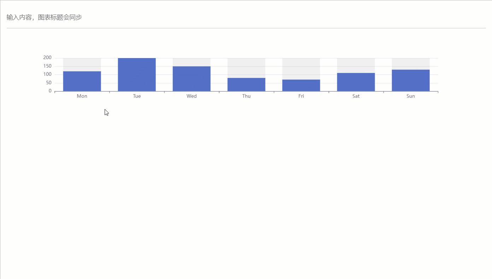
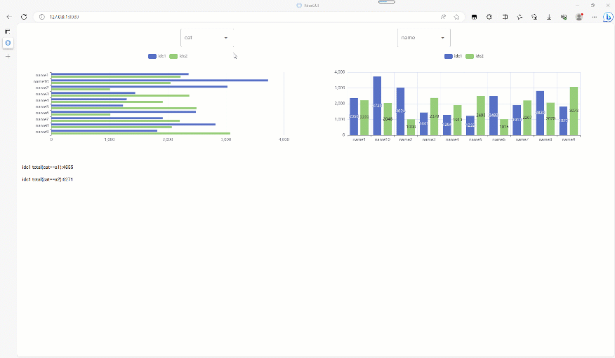

# ex4nicegui

<div align="center">

简体中文| [English](./README.en.md)

</div>

对 [nicegui](https://github.com/zauberzeug/nicegui) 做的扩展库。内置响应式组件，完全实现数据响应式界面编程。


[查看更多示例](https://gitee.com/carson_add/ex4nicegui-examples)

---

- [ex4nicegui](#ex4nicegui)
  - [教程](#教程)
  - [📦 安装](#-安装)
  - [示例项目](#示例项目)
  - [入门](#入门)
    - [二次计算](#二次计算)
    - [二次计算缓存](#二次计算缓存)
    - [列表](#列表)
    - [列表循环](#列表循环)
  - [apis](#apis)
    - [ViewModel](#viewmodel)
      - [使用列表](#使用列表)
    - [响应式](#响应式)
      - [`to_ref`](#to_ref)
      - [`deep_ref`](#deep_ref)
      - [`effect`](#effect)
      - [`ref_computed`](#ref_computed)
      - [`async_computed`](#async_computed)
      - [`on`](#on)
      - [`new_scope`](#new_scope)
    - [组件功能](#组件功能)
      - [vmodel](#vmodel)
      - [vfor](#vfor)
      - [bind\_classes](#bind_classes)
      - [bind\_style](#bind_style)
      - [bind\_prop](#bind_prop)
      - [rxui.echarts](#rxuiecharts)
        - [echarts 图表鼠标事件](#echarts-图表鼠标事件)
        - [rxui.echarts.from\_javascript](#rxuiechartsfrom_javascript)
        - [rxui.echarts.register\_map](#rxuiechartsregister_map)
      - [tab\_panels](#tab_panels)
      - [lazy\_tab\_panels](#lazy_tab_panels)
      - [scoped\_style](#scoped_style)
    - [BI 模块](#bi-模块)
      - [`bi.data_source`](#bidata_source)
      - [ui\_select](#ui_select)
      - [ui\_table](#ui_table)
      - [ui\_aggrid](#ui_aggrid)

---

## 教程
[头条文章-秒杀官方实现，python界面库，去掉90%事件代码的nicegui](https://www.toutiao.com/item/7253786340574265860/)

[微信公众号-秒杀官方实现，python界面库，去掉90%事件代码的nicegui](https://mp.weixin.qq.com/s?__biz=MzUzNDk1MTc5Mw==&mid=2247486796&idx=1&sn=457ed6fb9d6a25145f7704d5197d670d&chksm=fa8daf52cdfa2644bede50ae7f2551162ecaedecafec231ee4ce8f28775a599f8669ecf06af1#rd)


## 📦 安装

```
pip install ex4nicegui -U
```


## 示例项目
- [入门](./examples/basic/)
- [todo list mvc](./examples/todomvc/)

---

## 入门

我们从一个简单的计数器应用开始，用户可以通过点击按钮让计数增加或减少。


下面是完整代码：

```python
from nicegui import ui
from ex4nicegui import rxui

# 数据状态代码
class Counter(rxui.ViewModel):
    count: int = 0

    def increment(self):
        self.count += 1

    def decrement(self):
        self.count -= 1

# 界面代码
counter = Counter()

with ui.row(align_items="center"):
    ui.button(icon="remove", on_click=counter.decrement)
    rxui.label(counter.count)
    ui.button(icon="add", on_click=counter.increment)


ui.run()
```

---
现在看更多细节。`ex4nicegui` 遵从数据驱动方式定义界面。状态数据定义应用程序中所有可以变化的数据。

下面是 `Counter` 状态数据定义：

```python
class Counter(rxui.ViewModel):
    count: int = 0
```

- 自定义类需要继承 `rxui.ViewModel`
- 这里定义了一个变量 `count`，表示计数器的当前值，初始值为 0

接着，在类中定义一系列操作数据的方法：
```python
def increment(self):
    self.count += 1

def decrement(self):
    self.count -= 1
```

- 这些都是实例方法，可以修改 `count` 变量的值


然后，在界面代码中，实例化 `Counter` 的对象。
```python
counter = Counter()
```


我们通过 `rxui.label` 组件绑定 `count` 变量。把操作数据的方法绑定到按钮点击事件上。
```python
ui.button(icon="remove", on_click=counter.decrement)
rxui.label(counter.count)
ui.button(icon="add", on_click=counter.increment)
```

- 我们需要使用 `rxui` 命名空间下的 `label` 组件，而不是 `nicegui` 命名空间下的 `label` 组件。
- `rxui.label` 组件绑定 `counter.count` 变量，当 `counter.count` 变化时，`rxui.label` 组件自动更新。
- `ui.button` 组件绑定 `counter.decrement` 和 `counter.increment` 方法，点击按钮时调用相应方法。


> 在复杂项目中，`Counter` 定义的代码可以放到单独的模块中，然后在界面代码中导入。

注意，当类变量名前面带有下划线时，数据状态不会自动更新。

```python
class Counter(rxui.ViewModel):
    count: int = 0 # 响应式数据，能自动同步界面
    _count: int = 0 # 这里的下划线表示私有变量，不会自动同步界面

```

---

### 二次计算

接着前面的例子，我们再添加一个功能。当计数器的值小于 0 时，字体显示为红色，大于 0 时显示为绿色，否则显示为黑色。

```python
# 数据状态代码
class Counter(rxui.ViewModel):
    count: int = 0

    def text_color(self):
        if self.count > 0:
            return "green"
        elif self.count < 0:
            return "red"
        else:
            return "black"

    def increment(self):
        self.count += 1

    def decrement(self):
        self.count -= 1

# 界面代码
counter = Counter()

with ui.row(align_items="center"):
    ui.button(icon="remove", on_click=counter.decrement)
    rxui.label(counter.count).bind_color(counter.text_color)
    ui.button(icon="add", on_click=counter.increment)
```

颜色值是依据计数器当前值计算得到的。属于二次计算。通过定义普通的实例函数即可。

```python
def text_color(self):
    if self.count > 0:
        return "green"
    elif self.count < 0:
        return "red"
    else:
        return "black"
```


然后，通过 `rxui.label` 组件的 `bind_color` 方法绑定 `text_color` 方法，使得颜色值自动更新。
```python
rxui.label(counter.count).bind_color(counter.text_color)
```

### 二次计算缓存
现在，我们在计数器下方使用文字，显示当前计数器的颜色文本值。

```python
...
# 数据状态代码
class Counter(rxui.ViewModel):
    ...

# 界面代码
counter = Counter()

with ui.row(align_items="center"):
    ui.button(icon="remove", on_click=counter.decrement)
    rxui.label(counter.count).bind_color(counter.text_color)
    ui.button(icon="add", on_click=counter.increment)

rxui.label(lambda: f"当前计数器值为 {counter.count}, 颜色值为 {counter.text_color()}")
```

- 当二次计算非常简单时，可以直接使用 lambda 表达式

上面的代码中，有两个地方使用了 `counter.text_color` 方法。当 `counter.count` 变化时，`counter.text_color` 会执行两次计算。第二次计算是多余的。

为了避免多余的计算，我们可以把 `counter.text_color` 缓存起来。

```python
# 数据状态代码
class Counter(rxui.ViewModel):
    count: int = 0

    @rxui.cached_var
    def text_color(self):
        if self.count > 0:
            return "green"
        elif self.count < 0:
            return "red"
        else:
            return "black"

```

- `rxui.cached_var` 装饰器可以把函数结果缓存起来，避免多余的计算。

### 列表

下面的示例，展示了如何使用列表。

```python

class AppState(rxui.ViewModel):
    nums = []
    # nums = [1,2,3] ❌ 如果需要初始化，必须在 __init__ 中设置

    def __init__(self):
        super().__init__()
        self.nums = [1, 2, 3]

    def append(self):
        new_num = max(self.nums) + 1
        self.nums.append(new_num)

    def pop(self):
        self.nums.pop()

    def reverse(self):
        self.nums.reverse()

    def display_nums(self):
        return ", ".join(map(str, self.nums))


# 界面代码
state = AppState()

with ui.row(align_items="center"):
    ui.button("append", on_click=state.append)
    ui.button("pop", on_click=state.pop)
    ui.button("reverse", on_click=state.reverse)

rxui.label(state.display_nums)

```

如果你需要在定义列表时，初始化列表，建议在 `__init__` 中设置。
```python
class AppState(rxui.ViewModel):
    nums = []
    # nums = [1,2,3] ❌ 如果需要初始化，必须在 __init__ 中设置

    def __init__(self):
        super().__init__()
        self.nums = [1, 2, 3]

    ...
```

另一种方式是使用 `rxui.list_var`

```python
class AppState(rxui.ViewModel):
    # nums = []
    # nums = [1,2,3] ❌ 如果需要初始化，必须在 __init__ 中设置
    nums = rxui.list_var(lambda: [1, 2, 3])

    ...
```

- `rxui.list_var` 参数是一个返回列表的函数


### 列表循环

定义列表后，我们可以用 `effect_refreshable.on` 装饰器，在界面中展示列表数据。

下面的例子中，界面会动态展示下拉框选中的图标

```python
from ex4nicegui import rxui, effect_refreshable


class AppState(rxui.ViewModel):
    icons = []
    _option_icons = ["font_download", "warning", "format_size", "print"]


state = AppState()

# 界面代码
with ui.row(align_items="center"):

    @effect_refreshable.on(state.icons)
    def _():
        for icon in state.icons:
            ui.icon(icon, size="2rem")


rxui.select(state._option_icons, value=state.icons, multiple=True)
```

其中，`@effect_refreshable.on(state.icons)` 明确指定了依赖关系。当 `state.icons` 变化时，`_` 函数会重新执行。

```python
@effect_refreshable.on(state.icons)
def _():
    # 这里的代码会在 state.icons 变化时重新执行
    ...
```

> 注意，每次执行，里面的内容都会被清除。这是数据驱动版本的 `ui.refreshable`

原则上，可以不通过 `.on` 指定监控的数据，只要函数中使用到的"响应式数据"，都会自动监控
```python
@effect_refreshable # 没有使用 .on(state.icons)
def _():
    # 这里读取了 state.icons，因此会自动监控
    for icon in state.icons:
        ui.icon(icon, size="2rem")

```

> 建议总是通过 `.on` 指定依赖关系，避免预料之外的刷新


---


## apis

### ViewModel
在 `v0.7.0` 版本中，引入 `ViewModel` 类，用于管理一组响应式数据。

下面是一个简单的计算器示例：

1. 当用户修改数值输入框或符号选择框，右侧会自动显示计算结果
2. 当结果小于 0 时，结果显示为红色，否则为黑色

```python
from ex4nicegui import rxui

class Calculator(rxui.ViewModel):
    num1 = 0
    sign = "+"
    num2 = 0

    @rxui.cached_var
    def result(self):
        # 当 num1,sign,num2 任意一个值发生变化时，result 也会重新计算
        return eval(f"{self.num1}{self.sign}{self.num2}")

# 每个对象拥有独立的数据
calc = Calculator()

with ui.row(align_items="center"):
    rxui.number(value=calc.num1, label="Number 1")
    rxui.select(value=calc.sign, options=["+", "-", "*", "/"], label="Sign")
    rxui.number(value=calc.num2, label="Number 2")
    ui.label("=")
    rxui.label(calc.result).bind_color(
        lambda: "red" if calc.result() < 0 else "black"
    )

```

#### 使用列表

下面的示例，每个 person 使用卡片展示。最上方显示所有人的平均年龄。当个人年龄大于平均年龄，卡片外边框将变为红色。
通过 `number` 组件修改年龄，一切都会自动更新。

```python
from typing import List
from ex4nicegui import rxui
from itertools import count
from nicegui import ui

id_generator = count()

class Person(rxui.ViewModel):
    name = ""
    age = 0

    def __init__(self, name: str, age: int):
        super().__init__()
        self.name = name
        self.age = age
        self.id = next(id_generator)


class Home(rxui.ViewModel):
    persons: List[Person] = []
    deleted_person_index = 0

    @rxui.cached_var
    def avg_age(self) -> float:
        if len(self.persons) == 0:
            return 0

        return round(sum(p.age for p in self.persons) / len(self.persons), 2)

    def avg_name_length(self):
        if len(self.persons) == 0:
            return 0

        return round(sum(len(p.name) for p in self.persons) / len(self.persons), 2)

    def delete_person(self):
        if self.deleted_person_index < len(self.persons):
            del self.persons[int(self.deleted_person_index)]

    def sample_data(self):
        self.persons = [
            Person("alice", 25),
            Person("bob", 30),
            Person("charlie", 31),
            Person("dave", 22),
            Person("eve", 26),
            Person("frank", 29),
        ]


home = Home()
home.sample_data()

rxui.label(lambda: f"平均年龄: {home.avg_age()}")
rxui.label(lambda: f"平均名字长度: {home.avg_name_length()}")

rxui.number(
    value=home.deleted_person_index, min=0, max=lambda: len(home.persons) - 1, step=1
)
ui.button("删除", on_click=home.delete_person)

with ui.row():

    @rxui.vfor(home.persons, key="id")
    def _(store: rxui.VforStore[Person]):
        person = store.get_item()
        with rxui.card().classes("outline").bind_classes(
            {
                "outline-red-500": lambda: person.age > home.avg_age(),
            }
        ):
            rxui.input(value=person.name, placeholder="名字")
            rxui.number(value=person.age, min=1, max=100, step=1, placeholder="年龄")

ui.run()
```

如果你觉得 `rxui.vfor` 代码过于复杂，可以使用 `effect_refreshable` 装饰器代替。

```python
from ex4nicegui import rxui, Ref,effect_refreshable
...

# 明确指定监控 home.persons 变化，可以避免意外刷新
@effect_refreshable.on(home.persons)
def _():
    
    for person in home.persons.value:
        ...
        rxui.number(value=person.age, min=1, max=100, step=1, placeholder="年龄")
...
```

需要注意到，每当 `home.persons` 列表变化时(比如新增或删除元素)，`effect_refreshable` 装饰的函数都会重新执行。意味着所有元素都会重新创建。


更多复杂的应用，可以查看 [examples](./examples)

---


### 响应式

```python
from ex4nicegui import (
    to_ref,
    ref_computed,
    on,
    effect,
    effect_refreshable,
    batch,
    event_batch,
    deep_ref,
    async_computed
)
```
常用 `to_ref`,`deep_ref`,`effect`,`ref_computed`,`on`,`async_computed`

---

#### `to_ref`
定义响应式对象,通过 `.value` 读写
```python
a = to_ref(1)
b = to_ref("text")

a.value =2
b.value = 'new text'

print(a.value)
```

当值为复杂对象时，默认不会保持嵌套对象的响应性。
```python
a = to_ref([1,2])

@effect
def _():
    print('len:',len(a.value))

# 不会触发 effect
a.value.append(10)

# 整个替换则会触发
a.value = [1,2,10]
```

参数 `is_deep` 设置为 `True` 时，能得到深度响应能力

```python
a = to_ref([1,2],is_deep=True)

@effect
def _():
    print('len:',len(a.value))

# print 3
a.value.append(10)

```

>  `deep_ref` 等价于 `is_deep` 设置为 `True` 时的 `to_ref`

---

#### `deep_ref`
等价于 `is_deep` 设置为 `True` 时的 `to_ref`。

当数据源为列表、字典或自定义类时，特别有用。通过 `.value` 获取的对象为代理对象
```python
data = [1,2,3]
data_ref = deep_ref(data)

assert data_ref.value is not data
```

通过 `to_raw` 可以获取原始对象
```python
from ex4nicegui import to_raw, deep_ref

data = [1, 2, 3]
data_ref = deep_ref(data)

assert data_ref.value is not data
assert to_raw(data_ref.value) is data
```


---

#### `effect`
接受一个函数,自动监控函数中使用到的响应式对象变化,从而自动执行函数

```python
a = to_ref(1)
b = to_ref("text")


@effect
def auto_run_when_ref_value():
    print(f"a:{a.value}")


def change_value():
    a.value = 2
    b.value = "new text"


ui.button("change", on_click=change_value)
```

首次执行 effect ,函数`auto_run_when_ref_value`将被执行一次.之后点击按钮,改变 `a` 的值(通过 `a.value`),函数`auto_run_when_ref_value`再次执行

> 切忌把大量数据处理逻辑分散在多个 `on` 或 `effect` 中，`on` 或 `effect` 中应该大部分为界面操作逻辑，而非响应式数据处理逻辑

---

#### `ref_computed`
与 `effect` 具备一样的功能，`ref_computed` 还能从函数中返回结果。一般用于从 `to_ref` 中进行二次计算

```python
a = to_ref(1)
a_square = ref_computed(lambda: a.value * 2)


@effect
def effect1():
    print(f"a_square:{a_square.value}")


def change_value():
    a.value = 2


ui.button("change", on_click=change_value)
```

点击按钮后，`a.value` 值被修改，从而触发 `a_square` 重新计算.由于 `effect1` 中读取了 `a_square` 的值，从而触发 `effect1` 执行

> `ref_computed` 是只读的 `to_ref`

从 `v0.7.0` 版本开始，不建议使用 `ref_computed` 应用实例方法。你可以使用 `rxui.ViewModel`，并使用 `rxui.cached_var` 装饰器

```python
class MyState(rxui.ViewModel):
    def __init__(self) -> None:
        self.r_text = to_ref("")

    @rxui.cached_var
    def post_text(self):
        return self.r_text.value + "post"

state = MyState()

rxui.input(value=state.r_text)
rxui.label(state.post_text)
```

---

#### `async_computed`
二次计算中需要使用异步函数时，使用 `async_computed`
```python

# 模拟长时间执行的异步函数
async def long_time_query(input: str):
    await asyncio.sleep(2)
    num = random.randint(20, 100)
    return f"query result[{input=}]:{num=}"


search = to_ref("")
evaluating = to_ref(False)

@async_computed(search, evaluating=evaluating, init="")
async def search_result():
    return await long_time_query(search.value)

rxui.lazy_input(value=search)

rxui.label(
    lambda: "查询中" if evaluating.value else "上方输入框输入内容并回车搜索"
)
rxui.label(search_result)

```

- `async_computed` 第一个参数必须明确指定需要监控的响应式数据. 使用列表可以同时指定多个响应式数据
- 参数 `evaluating` 为 bool 类型的响应式数据，当异步函数执行中，此变量值为 `True`，计算结束后为 `False`
- 参数 `init` 指定初始结果


---

#### `on`
类似 `effect` 的功能,但是 `on` 需要明确指定监控的响应式对象

```python

a1 = to_ref(1)
a2 = to_ref(10)
b = to_ref("text")


@on(a1)
def watch_a1_only():
    print(f"watch_a1_only ... a1:{a1.value},a2:{a2.value}")


@on([a1, b], onchanges=True)
def watch_a1_and_b():
    print(f"watch_a1_and_b ... a1:{a1.value},a2:{a2.value},b:{b.value}")


def change_a1():
    a1.value += 1
    ui.notify("change_a1")


ui.button("change a1", on_click=change_a1)


def change_a2():
    a2.value += 1
    ui.notify("change_a2")


ui.button("change a2", on_click=change_a2)


def change_b():
    b.value += "x"
    ui.notify("change_b")


ui.button("change b", on_click=change_b)

```

- 参数 `onchanges` 为 True 时(默认值为 False),指定的函数不会在绑定时执行 


> 切忌把大量数据处理逻辑分散在多个 `on` 或 `effect` 中，`on` 或 `effect` 中应该大部分为界面操作逻辑，而非响应式数据处理逻辑

---

#### `new_scope`

默认情况下，所有检测函数在客户端连接断开时自动销毁。如果需要更细粒度的控制，可以使用 `new_scope`

```python
from nicegui import ui
from ex4nicegui import rxui, to_ref, effect, new_scope

a = to_ref(0.0)

scope1 = new_scope()

@scope1.run
def _():
    @effect
    def _():
        print(f"scope 1:{a.value}")


rxui.number(value=a)
rxui.button("dispose scope 1", on_click=scope1.dispose)
```

---


### 组件功能

#### vmodel
在表单输入元素或组件上创建双向绑定。

简单值类型的 `ref` 默认支持双向绑定
```python
from ex4nicegui import rxui, to_ref, deep_ref

data = to_ref("init")

rxui.label(lambda: f"{data.value=}")
# 默认就是双向绑定
rxui.input(value=data)
```

- 简单值类型一般是 `str`,`int` 等不可变值类型

当使用复杂数据结构时，会使用 `deep_ref` 保持嵌套值的响应性
```python
data = deep_ref({"a": 1, "b": [1, 2, 3, 4]})

rxui.label(lambda: f"{data.value=!s}")

# 当前版本没有任何绑定效果.或许未来的版本可以解决
rxui.input(value=data.value["a"])

# 只读绑定.其他途径修改了 `data.value["a"]` ，此输入框会同步，但反过来不行
rxui.input(value=lambda: data.value["a"])

# 要使用 vmodel 才能双向绑定
rxui.input(value=rxui.vmodel(data, "a"))

# 也可以直接使用，但不推荐
rxui.input(value=rxui.vmodel(data.value['a']))

```

- 第一个输入框将完全失去响应性，因为代码等价于 `rxui.input(value=1)`
- 第二个输入框由于使用函数，将得到读取响应性(第三个输入框输入值，将得到同步)
- 第三个输入框，使用 `rxui.vmodel` 包裹，即可实现双向绑定

> 如果使用 `rxui.ViewModel` ，你可能不需要使用 `vmodel`

可参考 [todo list 案例](./examples/todomvc/)

---

#### vfor
基于列表响应式数据，渲染列表组件。每项组件按需更新。数据项支持字典或任意类型对象。

从 `v0.7.0` 版本开始，建议配合 `rxui.ViewModel` 使用。与使用 `effect_refreshable` 装饰器不同，`vfor` 不会重新创建所有的元素，而是更新已存在的元素。

下面是卡片排序例子，卡片总是按年龄排序。当你修改某个卡片中的年龄数据时，卡片会实时调整顺序。但是，光标焦点不会离开输入框。


```python
from typing import List
from nicegui import ui
from ex4nicegui import rxui, deep_ref as ref, Ref


class Person(rxui.ViewModel):
    def __init__(self, name: str, age: int) -> None:
        self.name = name
        self.age = ref(age)


class MyApp(rxui.ViewModel):
    persons: Ref[List[Person]] = rxui.var(lambda: [])
    order = rxui.var("asc")

    def sort_by_age(self):
        return sorted(
            self.persons.value,
            key=lambda p: p.age.value,
            reverse=self.order.value == "desc",
        )

    @staticmethod
    def create():
        persons = [
            Person(name="Alice", age=25),
            Person(name="Bob", age=30),
            Person(name="Charlie", age=20),
            Person(name="Dave", age=35),
            Person(name="Eve", age=28),
        ]
        app = MyApp()
        app.persons.value = persons
        return app


# ui
app = MyApp.create()

with rxui.tabs(app.order):
    rxui.tab("asc", "Ascending")
    rxui.tab("desc", "Descending")


@rxui.vfor(app.sort_by_age, key="name")
def each_person(s: rxui.VforStore[Person]):
    person = s.get_item()

    with ui.card(), ui.row(align_items="center"):
        rxui.label(person.name)
        rxui.number(value=person.age, step=1, min=0, max=100)

```

- `rxui.vfor` 装饰器到自定义函数
    - 第一个参数传入响应式列表。注意，无须调用 `app.sort_by_age`
    - 第二个参数 `key`: 为了可以跟踪每个节点的标识，从而重用和重新排序现有的元素，你可以为每个元素对应的块提供一个唯一的 key 。默认情况使用列表元素索引。例子中假定每个人的名字唯一。
- 自定义函数带有一个参数。通过 `store.get_item` 可以获取当前行的对象。由于 Person 本身继承自 `rxui.ViewModel`，所以它的各项属性可以直接绑定到组件。


---

#### bind_classes

所有的组件类提供 `bind_classes` 用于绑定 `class`，支持三种不同的数据结构。

绑定字典

```python
bg_color = to_ref(False)
has_error = to_ref(False)

rxui.label("test").bind_classes({"bg-blue": bg_color, "text-red": has_error})

rxui.switch("bg_color", value=bg_color)
rxui.switch("has_error", value=has_error)
```

字典键值为类名,对应值为 bool 的响应式变量。当响应式值为 `True`，类名应用到组件 class


---

绑定返回值为字典的响应式变量

```python
bg_color = to_ref(False)
has_error = to_ref(False)

class_obj = ref_computed(
    lambda: {"bg-blue": bg_color.value, "text-red": has_error.value}
)

rxui.switch("bg_color", value=bg_color)
rxui.switch("has_error", value=has_error)
rxui.label("bind to ref_computed").bind_classes(class_obj)
# or direct function passing
rxui.label("bind to ref_computed").bind_classes(
    lambda: {"bg-blue": bg_color.value, "text-red": has_error.value}
)
```

---

绑定为列表或单个字符串的响应式变量

```python
bg_color = to_ref("red")
bg_color_class = ref_computed(lambda: f"bg-{bg_color.value}")

text_color = to_ref("green")
text_color_class = ref_computed(lambda: f"text-{text_color.value}")

rxui.select(["red", "green", "yellow"], label="bg color", value=bg_color)
rxui.select(["red", "green", "yellow"], label="text color", value=text_color)

rxui.label("binding to arrays").bind_classes([bg_color_class, text_color_class])
rxui.label("binding to single string").bind_classes(bg_color_class)
```

- 列表中每个元素为返回类名的响应式变量


---

#### bind_style

```python
from nicegui import ui
from ex4nicegui.reactive import rxui
from ex4nicegui.utils.signals import to_ref


bg_color = to_ref("blue")
text_color = to_ref("red")

rxui.label("test").bind_style(
    {
        "background-color": bg_color,
        "color": text_color,
    }
)

rxui.select(["blue", "green", "yellow"], label="bg color", value=bg_color)
rxui.select(["red", "green", "yellow"], label="text color", value=text_color)
```

`bind_style` 传入字典，`key` 为样式名字，`value` 为样式值，响应式字符串

---

#### bind_prop

绑定单个属性

```python

label = to_ref("hello")

rxui.button("").bind_prop("label", label)
# 允许使用函数
rxui.button("").bind_prop(
    "label", lambda: f"{label.value} world"
)

rxui.input(value=label)
```


---

#### rxui.echarts
使用 echarts 制作图表

```python
from nicegui import ui
from ex4nicegui import ref_computed, effect, to_ref
from ex4nicegui.reactive import rxui

r_input = to_ref("")

# ref_computed 创建只读响应式变量
# 函数中使用任意其他响应式变量，会自动关联
@ref_computed
def cp_echarts_opts():
    return {
        "title": {"text": r_input.value}, #字典中使用任意响应式变量，通过 .value 获取值
        "xAxis": {
            "type": "category",
            "data": ["Mon", "Tue", "Wed", "Thu", "Fri", "Sat", "Sun"],
        },
        "yAxis": {"type": "value"},
        "series": [
            {
                "data": [120, 200, 150, 80, 70, 110, 130],
                "type": "bar",
                "showBackground": True,
                "backgroundStyle": {"color": "rgba(180, 180, 180, 0.2)"},
            }
        ],
    }

input = rxui.input("输入内容，图表标题会同步", value=r_input)
# 通过响应式组件对象的 element 属性，获取原生 nicegui 组件对象
input.element.classes("w-full")

rxui.echarts(cp_echarts_opts)

ui.run()
```



##### echarts 图表鼠标事件

`on` 函数参数 `event_name` 以及 `query` 使用,查看[echarts 事件中文文档](https://echarts.apache.org/handbook/zh/concepts/event/)


以下例子绑定鼠标单击事件
```python
from nicegui import ui
from ex4nicegui.reactive import rxui

opts = {
    "xAxis": {"type": "value", "boundaryGap": [0, 0.01]},
    "yAxis": {
        "type": "category",
        "data": ["Brazil", "Indonesia", "USA", "India", "China", "World"],
    },
    "series": [
        {
            "name": "first",
            "type": "bar",
            "data": [18203, 23489, 29034, 104970, 131744, 630230],
        },
        {
            "name": "second",
            "type": "bar",
            "data": [19325, 23438, 31000, 121594, 134141, 681807],
        },
    ],
}

bar = rxui.echarts(opts)

def on_click(e: rxui.echarts.EChartsMouseEventArguments):
    ui.notify(f"on_click:{e.seriesName}:{e.name}:{e.value}")


bar.on("click", on_click)
```


以下例子只针对指定系列触发鼠标划过事件
```python
from nicegui import ui
from ex4nicegui.reactive import rxui

opts = {
    "xAxis": {"type": "value", "boundaryGap": [0, 0.01]},
    "yAxis": {
        "type": "category",
        "data": ["Brazil", "Indonesia", "USA", "India", "China", "World"],
    },
    "series": [
        {
            "name": "first",
            "type": "bar",
            "data": [18203, 23489, 29034, 104970, 131744, 630230],
        },
        {
            "name": "second",
            "type": "bar",
            "data": [19325, 23438, 31000, 121594, 134141, 681807],
        },
    ],
}

bar = rxui.echarts(opts)

def on_first_series_mouseover(e: rxui.echarts.EChartsMouseEventArguments):
    ui.notify(f"on_first_series_mouseover:{e.seriesName}:{e.name}:{e.value}")


bar.on("mouseover", on_first_series_mouseover, query={"seriesName": "first"})

ui.run()
```
---


---

##### rxui.echarts.from_javascript
从 javascript 代码创建 echart

```python
from pathlib import Path

rxui.echarts.from_javascript(Path("code.js"))
# or
rxui.echarts.from_javascript(
    """
(myChart) => {

    option = {
        xAxis: {
            type: 'category',
            data: ['Mon', 'Tue', 'Wed', 'Thu', 'Fri', 'Sat', 'Sun']
        },
        yAxis: {
            type: 'value'
        },
        series: [
            {
                data: [120, 200, 150, 80, 70, 110, 130],
                type: 'bar'
            }
        ]
    };

    myChart.setOption(option);
}
"""
)
```

- 函数第一个参数为 echart 实例对象.你需要在函数中通过 `setOption` 完成图表配置

函数也有第二个参数，为 `echarts` 全局对象，你可以通过 `echarts.registerMap` 注册地图。

```python
rxui.echarts.from_javascript(
"""
(chart,echarts) =>{

    fetch('https://geo.datav.aliyun.com/areas_v3/bound/100000_full.json')
    .then(response => response.json())
    .then(data => {
            echarts.registerMap('test_map', data);

            chart.setOption({
                geo: {
                    map: 'test_map',
                    roam: true,
                },
                tooltip: {},
                legend: {},
                series: [],
            });
    });
}
"""
)
```

---

##### rxui.echarts.register_map
注册地图.

```python
rxui.echarts.register_map(
    "china", "https://geo.datav.aliyun.com/areas_v3/bound/100000_full.json"
)

rxui.echarts(
    {
        "geo": {
            "map": "china",
            "roam": True,
        },
        "tooltip": {},
        "legend": {},
        "series": [],
    }
)
```

- 参数 `map_name` 为自定义的地图名字。注意在图表配置中 `map` 必需对应注册的名字
- 参数 `src` 为有效的地图数据网络链接。


如果是 svg 数据，需要设置参数 `type="svg"`
```python
rxui.echarts.register_map("svg-rect", "/test/svg", type="svg")
```


你也可以直接提供本地地图数据的json文件路径对象(Path)
```python
from pathlib import Path

rxui.echarts.register_map(
    "china", Path("map-data.json")
)
```

---

#### tab_panels

相比较于 `nicegui.ui.tab_panels` , `rxui.tab_panels` 没有参数 `tabs`。在数据响应式机制下，`tabs` 与 `tab_panels` 联动只需要通过参数 `value` 即可。

```python
from nicegui import ui
from ex4nicegui import rxui, to_ref

names = ["Tab 1", "Tab 2", "Tab 3"]
current_tab = to_ref(names[0])

with rxui.tabs(current_tab):
    for name in names:
        rxui.tab(name)

with rxui.tab_panels(current_tab):
    for name in names:
        with rxui.tab_panel(name):
            ui.label(f"Content of {name}")
```

这是因为，数据响应机制下，组件联动是通过中间数据层(`to_ref`)实现的。因此，`tab_panels` 可以与其他组件联动(只需要保证使用同样的 `ref` 对象即可)

```python
names = ["Tab 1", "Tab 2", "Tab 3"]
current_tab = to_ref(names[0])


with rxui.tab_panels(current_tab):
    for name in names:
        with rxui.tab_panel(name):
            ui.label(f"Content of {name}")

# tabs 不必在 panels 前面
with rxui.tabs(current_tab):
    for name in names:
        rxui.tab(name)

rxui.select(names, value=current_tab)
rxui.radio(names, value=current_tab).props("inline")

rxui.label(lambda: f"当前 tab 为:{current_tab.value}")
```
---

#### lazy_tab_panels

懒加载模式下，只有当前激活的 tab 才会渲染。
```python
from ex4nicegui import to_ref, rxui, on, deep_ref

current_tab = to_ref("t1")

with rxui.tabs(current_tab):
    ui.tab("t1")
    ui.tab("t2")

with rxui.lazy_tab_panels(current_tab) as panels:

    @panels.add_tab_panel("t1")
    def _():
        ui.notify("Hello from t1")

    @panels.add_tab_panel("t2")
    def _():
        ui.notify("Hello from t2")

```

页面加载后，立刻显示 "Hello from t1"。当切换到 "t2" 页签，才会显示 "Hello from t2"。

---

#### scoped_style

`scoped_style` 方法允许你创建限定在组件内部的样式。

```python
# 所有子元素都会有红色轮廓，但排除自身
with rxui.row().scoped_style("*", "outline: 1px solid red;") as row:
    ui.label("Hello")
    ui.label("World")


# 所有子元素都会有红色轮廓，包括自身
with rxui.row().scoped_style(":self *", "outline: 1px solid red;") as row:
    ui.label("Hello")
    ui.label("World")

# 当鼠标悬停在 row 组件时,所有子元素都会有红色轮廓，但排除自身
with rxui.row().scoped_style(":hover *", "outline: 1px solid red;") as row:
    ui.label("Hello")
    ui.label("World")

# 当鼠标悬停在 row 组件时,所有子元素都会有红色轮廓，包括自身
with rxui.row().scoped_style(":self:hover *", "outline: 1px solid red;") as row:
    ui.label("Hello")
    ui.label("World")
```


---

### BI 模块

以最精简的 apis 创建可交互的数据可视化报表



```python
from nicegui import ui
import pandas as pd
import numpy as np
from ex4nicegui import bi
from ex4nicegui.reactive import rxui
from ex4nicegui import effect, effect_refreshable
from pyecharts.charts import Bar


# data ready
def gen_data():
    np.random.seed(265)
    field1 = ["a1", "a2", "a3", "a4"]
    field2 = [f"name{i}" for i in range(1, 11)]
    df = (
        pd.MultiIndex.from_product([field1, field2], names=["cat", "name"])
        .to_frame()
        .reset_index(drop=True)
    )
    df[["idc1", "idc2"]] = np.random.randint(50, 1000, size=(len(df), 2))
    return df


df = gen_data()

# 创建数据源
ds = bi.data_source(df)

# ui
ui.query(".nicegui-content").classes("items-stretch no-wrap")

with ui.row().classes("justify-evenly"):
    # 基于数据源 `ds` 创建界面组件
    ds.ui_select("cat").classes("min-w-[10rem]")
    ds.ui_select("name").classes("min-w-[10rem]")


with ui.grid(columns=2):
    # 使用字典配置图表
    @ds.ui_echarts
    def bar1(data: pd.DataFrame):
        data = data.groupby("name").agg({"idc1": "sum", "idc2": "sum"}).reset_index()

        return {
            "xAxis": {"type": "value"},
            "yAxis": {
                "type": "category",
                "data": data["name"].tolist(),
                "inverse": True,
            },
            "legend": {"textStyle": {"color": "gray"}},
            "series": [
                {"type": "bar", "name": "idc1", "data": data["idc1"].tolist()},
                {"type": "bar", "name": "idc2", "data": data["idc2"].tolist()},
            ],
        }

    bar1.classes("h-[20rem]")

    # 使用pyecharts配置图表
    @ds.ui_echarts
    def bar2(data: pd.DataFrame):
        data = data.groupby("name").agg({"idc1": "sum", "idc2": "sum"}).reset_index()

        return (
            Bar()
            .add_xaxis(data["name"].tolist())
            .add_yaxis("idc1", data["idc1"].tolist())
            .add_yaxis("idc2", data["idc2"].tolist())
        )

    bar2.classes("h-[20rem]")

    # 绑定点击事件，即可实现跳转
    @bar2.on_chart_click
    def _(e: rxui.echarts.EChartsMouseEventArguments):
        ui.open(f"/details/{e.name}", new_tab=True)


# 利用响应式机制，你可以随意组合原生 nicegui 组件
label_a1_total = ui.label("")


# 当 ds 有变化，都会触发此函数
@effect
def _():
    # filtered_data 为过滤后的 DataFrame
    df = ds.filtered_data
    total = df[df["cat"] == "a1"]["idc1"].sum()
    label_a1_total.text = f"idc1 total(cat==a1):{total}"


# 你也可以使用 `effect_refreshable`,但需要注意函数中的组件每次都被重建
@effect_refreshable
def _():
    df = ds.filtered_data
    total = df[df["cat"] == "a2"]["idc1"].sum()
    ui.label(f"idc1 total(cat==a2):{total}")


# 当点击图表系列时，跳转的页面
@ui.page("/details/{name}")
def details_page(name: str):
    ui.label("This table data will not change")
    ui.aggrid.from_pandas(ds.data.query(f'name=="{name}"'))

    ui.label("This table will change when the homepage data changes. ")

    @bi.data_source
    def new_ds():
        return ds.filtered_data[["name", "idc1", "idc2"]]

    new_ds.ui_aggrid()


ui.run()
```

---

#### `bi.data_source`
数据源是 BI 模块的核心概念，所有数据的联动基于此展开。当前版本(0.4.3)中，有两种创建数据源的方式

接收 `pandas` 的 `DataFrame`:
```python
from nicegui import ui
from ex4nicegui import bi
import pandas as pd

df = pd.DataFrame(
    {
        "name": list("aabcdf"),
        "cls": ["c1", "c2", "c1", "c1", "c3", None],
        "value": range(6),
    }
)

ds =  bi.data_source(df)
```

---
有时候，我们希望基于另一个数据源创建新的数据源，此时可以使用装饰器创建联动数据源:
```python
df = pd.DataFrame(
    {
        "name": list("aabcdf"),
        "cls": ["c1", "c2", "c1", "c1", "c3", None],
        "value": range(6),
    }
)

ds =  bi.data_source(df)

@bi.data_source
def new_ds():
    # df is pd.DataFrame 
    df = ds.filtered_data
    df=df.copy()
    df['value'] = df['value'] * 100
    return df

ds.ui_select('name')
new_ds.ui_aggrid()

```

注意，由于 `new_ds` 中使用了 `ds.filtered_data` ，因此 `ds` 的变动会触发 `new_ds` 的联动变化，从而导致 `new_ds` 创建的表格组件产生变化

---
通过 `ds.remove_filters` 方法，移除所有筛选状态:
```python
ds = bi.data_source(df)

def on_remove_filters():
    ds.remove_filters()

ui.button("remove all filters", on_click=on_remove_filters)

ds.ui_select("name")
ds.ui_aggrid()
```
---

通过 `ds.reload` 方法，重设数据源:
```python

df = pd.DataFrame(
    {
        "name": list("aabcdf"),
        "cls": ["c1", "c2", "c1", "c1", "c3", None],
        "value": range(6),
    }
)

new_df = pd.DataFrame(
    {
        "name": list("xxyyds"),
        "cls": ["cla1", "cla2", "cla3", "cla3", "cla3", None],
        "value": range(100, 106),
    }
)

ds = bi.data_source(df)

def on_remove_filters():
    ds.reload(new_df)

ui.button("reload data", on_click=on_remove_filters)

ds.ui_select("name")
ds.ui_aggrid()
```

---
#### ui_select

```python
from nicegui import ui
from ex4nicegui import bi
import pandas as pd

df = pd.DataFrame(
    {
        "name": list("aabcdf"),
        "cls": ["c1", "c2", "c1", "c1", "c3", None],
        "value": range(6),
    }
)

ds = bi.data_source(df)

ds.ui_select("name")
```

第一个参数 column 指定数据源的列名

---
通过参数 `sort_options` 设置选项顺序:
```python
ds.ui_select("name", sort_options={"value": "desc", "name": "asc"})

```

---
参数 `exclude_null_value` 设置是否排除空值:
```python
df = pd.DataFrame(
    {
        "cls": ["c1", "c2", "c1", "c1", "c3", None],
    }
)

ds = bi.data_source(df)
ds.ui_select("cls", exclude_null_value=True)
```

---

你可以通过关键字参数，设置原生 nicegui select 组件的参数.

通过 value 属性，设置默认值:
```python
ds.ui_select("cls",value=['c1','c2'])
ds.ui_select("cls",multiple=False,value='c1')

```

多选时(参数 `multiple` 默认为 True)，`value` 需要指定为 list

单选时，`value` 设置为非 list

---

#### ui_table

表格

```python
from nicegui import ui
from ex4nicegui import bi
import pandas as pd

data = pd.DataFrame({"name": ["f", "a", "c", "b"], "age": [1, 2, 3, 1]})
ds = bi.data_source(data)

ds.ui_table(
    columns=[
        {"label": "new colA", "field": "colA", "sortable": True},
    ]
)

```

- columns 与 nicegui `ui.table` 一致。其中 键值 `field` 对应数据源的列名，如果不存在，则该配置不会生效
- rows 参数不会生效。因为表格的数据源始终由 data source 控制

---

#### ui_aggrid


```python
from nicegui import ui
from ex4nicegui import bi
import pandas as pd

data = pd.DataFrame(
    {
        "colA": list("abcde"),
        "colB": [f"n{idx}" for idx in range(5)],
        "colC": list(range(5)),
    }
)
df = pd.DataFrame(data)

source = bi.data_source(df)

source.ui_aggrid(
    options={
        "columnDefs": [
            {"headerName": "xx", "field": "no exists"},
            {"headerName": "new colA", "field": "colA"},
            {
                "field": "colC",
                "cellClassRules": {
                    "bg-red-300": "x < 3",
                    "bg-green-300": "x >= 3",
                },
            },
        ],
        "rowData": [{"colX": [1, 2, 3, 4, 5]}],
    }
)
```

- 参数 options 与 nicegui `ui.aggrid` 一致。其中 `columnDefs` 中的键值 `field` 对应数据源的列名，如果不存在，则该配置不会生效
- `rowData` 键值不会生效。因为表格的数据源始终由 data source 控制


